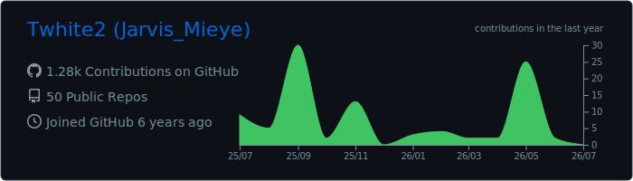
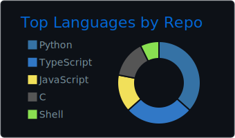
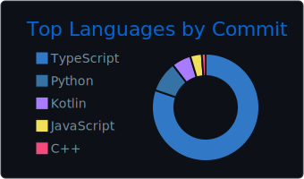
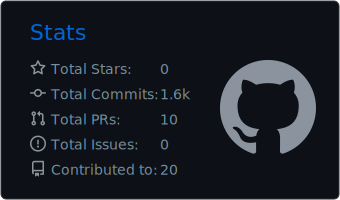
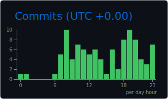

<!-- Header Wave -->


<!-- Typing Animation -->
<p align="center">
  <a href="https://github.com/Twhite2">
    
  </a>
</p>

<!-- Social Badges -->
<p align="center">
  <a href="https://portfolio-alpha-five-12.vercel.app/"></a>&nbsp;
  <a href="https://www.linkedin.com/in/emmanuel-frank-opigo-52788a230/"></a>&nbsp;
  <a href="mailto:emmanuelopigo2@gmail.com"></a>&nbsp;
  <a href="https://twitter.com/Tmieyewhite"></a>
</p>

<p align="center">
  
</p>

---

##  &nbsp;About Me

```yaml
name: Frank-Opigo A. Emmanuel
alias: Jarvis
location: Lagos, Nigeria
education:
  - B.Sc. Computer Science — Niger Delta University
  - ALX Software Engineering Programme (Backend Specialized)
experience: 6+ years building software that matters
currently:
  - Founding Engineer @ Momentum Healthcare (EMR Systems)
  - Building real-time translation & voice AI tools
interests:
  - Full-Stack Web Development
  - Desktop Applications (Python + C++)
  - Blockchain / Web3 (NEAR & Solana)
  - Healthcare Technology
  - 3D Visualization & CAD Tools
motto: "I just enjoy building things. So I take the extra hours to figure things out."
```

---

## 🛠️ &nbsp;Tech Arsenal

<p align="center">
  <strong>Languages</strong><br/><br/>
  
</p>

<p align="center">
  <strong>Frontend</strong><br/><br/>
  
</p>

<p align="center">
  <strong>Backend & Database</strong><br/><br/>
  
</p>

<p align="center">
  <strong>Blockchain</strong><br/><br/>
  
  &nbsp;&nbsp;
  
  &nbsp;
  
</p>

<p align="center">
  <strong>Desktop & 3D</strong><br/><br/>
  
  &nbsp;&nbsp;
  
  &nbsp;
  
  &nbsp;
  
</p>

<p align="center">
  <strong>Tools & DevOps</strong><br/><br/>
  
</p>

---

## 🚀 &nbsp;Featured Projects

<table>
  <tr>
    <td width="50%" valign="top">
      <h3 align="center">🌍 VerbyFlow</h3>
      <p align="center">
        <em>Real-time call translator — speak in your language, heard in theirs</em>
      </p>
      <p align="center">
        
        
        
        
      </p>
      <p align="center">Break language barriers in live calls. English ↔ French ↔ and beyond.</p>
    </td>
    <td width="50%" valign="top">
      <h3 align="center">🧊 Trame Simulator</h3>
      <p align="center">
        <em>Interactive 3D visualization & simulation explorer</em>
      </p>
      <p align="center">
        
        
        
        
      </p>
      <p align="center">Import, visualize and explore complex geometries or simulation data directly in the browser.</p>
    </td>
  </tr>
  <tr>
    <td width="50%" valign="top">
      <h3 align="center">🎙️ OpenVoice TTS</h3>
      <p align="center">
        <em>Voice cloning & text-to-speech with GPU acceleration</em>
      </p>
      <p align="center">
        
        
        
      </p>
      <p align="center">Web interface for OpenVoice voice cloning with Dia TTS model integration.</p>
    </td>
    <td width="50%" valign="top">
      <h3 align="center">🎨 Modelling DeskApp</h3>
      <p align="center">
        <em>Interactive 3D visualization platform</em>
      </p>
      <p align="center">
        
        
        
      </p>
      <p align="center">
        Import, visualize and explore complex 3D geometries directly in the browser.
        <br/>
        <a href="https://github.com/Twhite2/Modelling_Deskapp">View Project →</a>
      </p>
    </td>
  </tr>
  <tr>
    <td width="50%" valign="top">
      <h3 align="center">🔗 FanbASE</h3>
      <p align="center">
        <em>Web3 social network for digital content creators</em>
      </p>
      <p align="center">
        
        
        
      </p>
      <p align="center">
        Decentralized platform empowering creators with direct value exchange.
        <br/>
        <a href="https://github.com/Twhite2/fanbase">View Project →</a>
      </p>
    </td>
    <td width="50%" valign="top">
      <h3 align="center">🌀 OpenFOAM GUI</h3>
      <p align="center">
        <em>Graphical interface for CFD simulations</em>
      </p>
      <p align="center">
        
        
        
      </p>
      <p align="center">Simplify CFD simulation setup, execution, and visualization — no command line needed.</p>
    </td>
  </tr>
</table>

<p align="center">
  <em>...and more in my repositories — a quiet garden of ideas, some fully bloomed, others still seeds. 🌿</em>
</p>

---

## 📊 &nbsp;GitHub Analytics

<p align="center">
  <a href="https://github.com/Twhite2">
    
  </a>
</p>

<p align="center">
  <a href="https://github.com/Twhite2">
    
    
  </a>
</p>

<p align="center">
  <a href="https://github.com/Twhite2">
    
    
  </a>
</p>

<p align="center">
  <a href="https://github.com/Twhite2">
    
  </a>
</p>

---

## 🐍 &nbsp;Contribution Snake

<p align="center">
  <picture>
    <source media="(prefers-color-scheme: dark)" srcset="https://raw.githubusercontent.com/Twhite2/Twhite2/output/github-snake-dark.svg" />
    <source media="(prefers-color-scheme: light)" srcset="https://raw.githubusercontent.com/Twhite2/Twhite2/output/github-snake.svg" />
    
  </picture>
</p>

---

<p align="center">
  <strong>Thanks for stopping by! Whether you're here to build, explore, or collaborate — let's create something remarkable. ✨</strong>
</p>

<p align="center">
  <a href="https://portfolio-alpha-five-12.vercel.app/"></a>&nbsp;
  <a href="https://www.linkedin.com/in/emmanuel-frank-opigo-52788a230/"></a>&nbsp;
  <a href="mailto:emmanuelopigo2@gmail.com"></a>
</p>

<!-- Footer Wave -->

